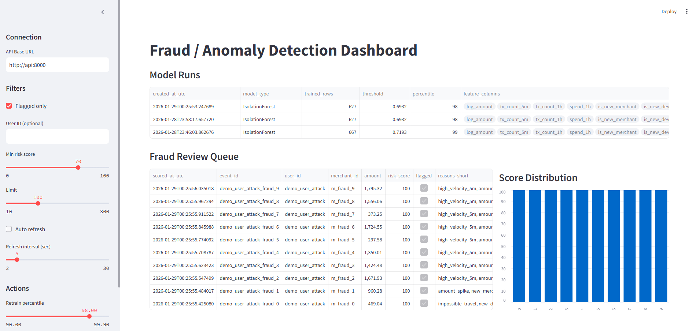

# Fraud Anomaly Detection System

A production-style fraud and anomaly detection system built with FastAPI, Isolation Forest, and Streamlit.

The system ingests transactional events, derives behavioral features, trains an unsupervised ML model, scores events in real time, and surfaces explainable fraud alerts through an analyst dashboard.

---

## System Overview

This project simulates how modern fraud detection systems work in practice:

- Event ingestion via REST API
- Feature engineering (velocity, novelty, geo-distance, time patterns)
- Unsupervised ML training using Isolation Forest
- Real-time scoring with dynamic thresholds
- Explainable alerts with human-readable reason codes
- Fraud review queue for analysts
- Interactive dashboard for monitoring and investigation
- Dockerized deployment using Docker Compose

---

## Dashboard Preview

## Architecture

Client / Script  
→ FastAPI Service  
→ SQLite Database  
→ ML Artifacts  
→ Streamlit Dashboard

FastAPI endpoints:

- /ingest
- /score
- /score-by-event-id
- /retrain
- /scores
- /model-runs

---

## Fraud Signals Modeled

### Behavioral Velocity

- Transactions per 5 minutes
- Transactions per hour
- Spend per hour

### Novelty

- New merchant
- New device
- New IP address

### Geographic Anomalies

- Distance between consecutive transactions
- Implied travel speed (km/h)
- Impossible travel detection

### Temporal Patterns

- Hour of day
- Day of week

---

## Machine Learning

- Model: Isolation Forest (unsupervised)
- Training: Periodic retraining via API
- Thresholding: Percentile-based anomaly cutoff
- Outputs:
  - anomaly_score
  - risk_score (0–100)
  - flagged decision
  - explanation reasons

The system does not require labeled fraud data and adapts as behavior changes.

---

## API Endpoints

POST /ingest  
POST /score  
POST /score-by-event-id  
POST /retrain  
GET /events  
GET /scores  
GET /model-runs

Interactive API docs:
http://localhost:8000/docs

---

## Running Locally (No Docker)

python -m venv .venv  
.venv\\Scripts\\activate  
pip install -r requirements.txt  
uvicorn app.main:app --host 127.0.0.1 --port 8000

Dashboard (new terminal):

streamlit run dashboard/dashboard.py

---

## Running with Docker (Recommended)

docker compose up --build

API:
http://localhost:8000/docs

Dashboard:
http://localhost:8501

When running in Docker, set the dashboard API Base URL to:

http://api:8000

---

## Demo: Simulated Fraud Attack

A full demo script is included:

python training/demo_attack.py

The demo:

1. Retrains the model
2. Generates normal user behavior
3. Launches a fraud burst:
   - New device and IP
   - Geographic jump
   - High velocity
   - Large transaction amounts
4. Flags fraudulent events with explanations
5. Populates the review queue

---

## Testing

Basic unit tests validate geo-distance calculations:

pytest

---

## What This Demonstrates

- End-to-end ML system design
- Feature engineering for fraud detection
- Unsupervised anomaly detection
- Model lifecycle management
- Explainable AI decisions
- API and dashboard integration
- Dockerized deployment

---

## Future Improvements

- Kafka-based ingestion
- Async scoring workers
- Redis feature cache
- Model drift detection
- Authentication and RBAC
- Multi-model ensemble scoring
